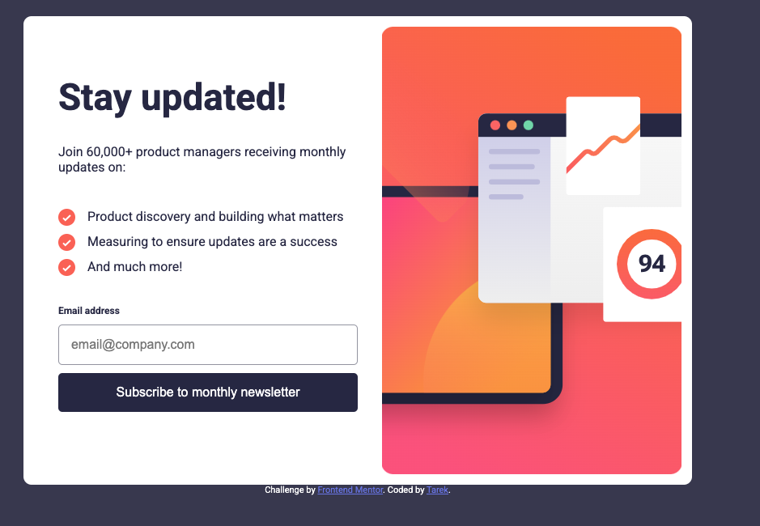
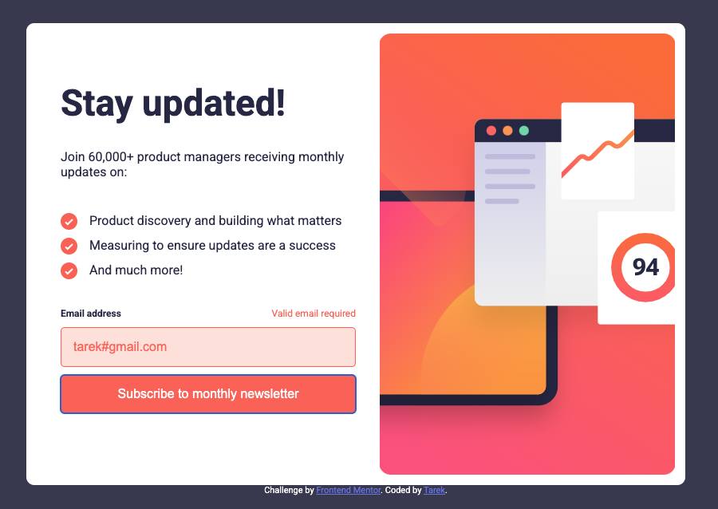
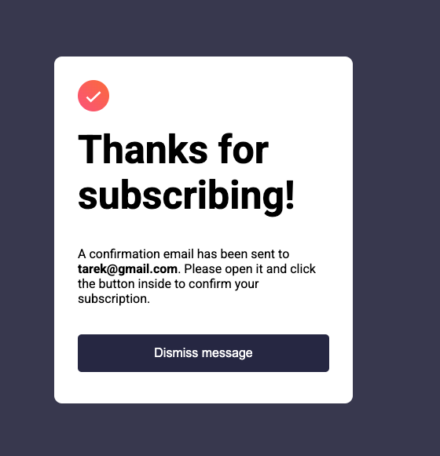
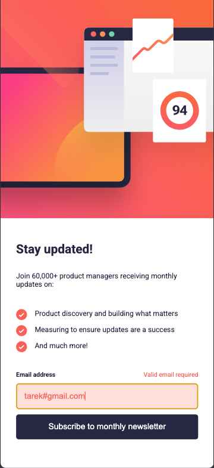
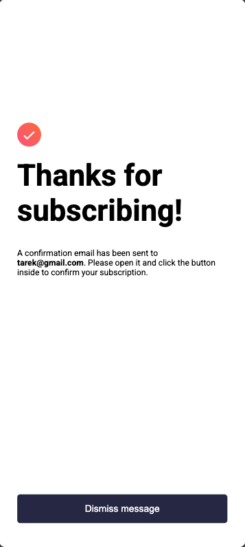

# Frontend Mentor - Newsletter sign-up form with success message

## Accomplishments

In this project, I am proud of the following achievements:

1. **Responsive Design**: Implemented responsive design techniques to ensure the newsletter sign-up form looks great on both desktop and mobile devices.

2. **Form Validation**: Added client-side validation for the email input, enhancing user experience by providing immediate feedback.

3. **Dynamic User Feedback**: Created a success message that displays the user's email after form submission, helping users feel confident in their actions.

4. **Use of Modern CSS Techniques**: Utilized CSS features like flexbox for layout and responsive font sizes with the `clamp()` function.

5. **Clean Code Structure**: Maintained an organized code structure, making it easier to read and maintain.

6. **Effective Use of Media Queries**: Implemented media queries to adjust styles based on screen size, ensuring a responsive design.

7. **Project Completion**: Successfully completed a project that involves multiple technologies (HTML, CSS, JavaScript), reflecting dedication and the ability to see a project through.

## What I Learned

In this project, I learned the following:

1. **Responsive Design**: Understanding the importance of responsive design and how to implement it effectively.

2. **Form Validation**: Learning how to implement client-side form validation to provide immediate feedback to users.

3. **Dynamic User Feedback**: Understanding how to create dynamic user feedback, such as a success message after form submission.

4. **Use of Modern CSS Techniques**: Exploring the power of CSS features like flexbox and responsive font sizes.

5. **Clean Code Structure**: Developing a clean and organized code structure, making it easier to read and maintain.

6. **Effective Use of Media Queries**: Implementing media queries to adjust styles based on screen size, ensuring a responsive design.

### Challenges

During this project, I encountered the following challenges:

1. **Responsive Design**: Implementing responsive design techniques to ensure the newsletter sign-up form looks great on both desktop and mobile devices.

2. **Form Validation**: Implementing client-side form validation to provide immediate feedback to users.

3. **Dynamic User Feedback**: Creating a success message that displays the user's email after form submission.

4. **Use of Modern CSS Techniques**: Understanding the power of CSS features like flexbox and responsive font sizes.